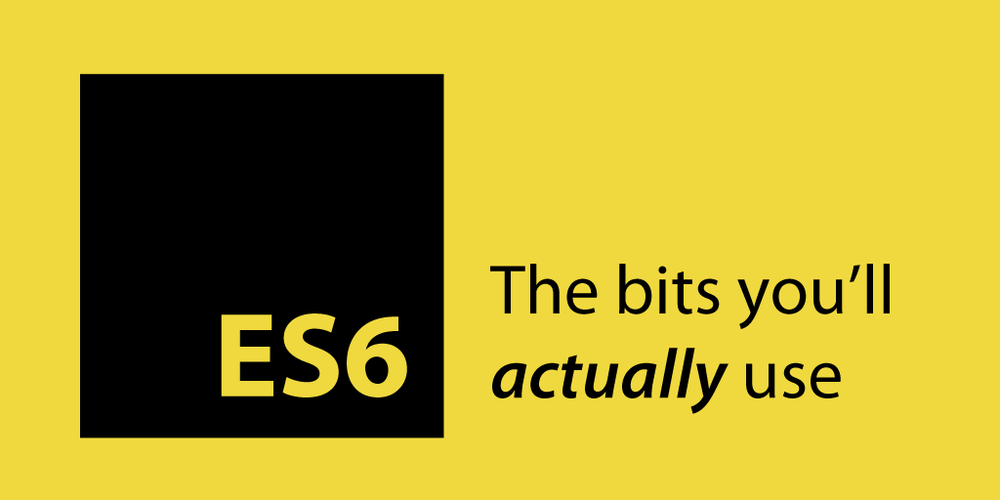

#HSLIDE?image=pitchme/assets/es6-background.png

# ES6 Basics

Hola!

#VSLIDE

## Testing 1




#VSLIDE 
Arrow functions

#VSLIDE 

## let, const

```
function foo () {
  typeof bar;
  let bar = ‘baz’;
}
foo(); // ReferenceError: can't access lexical declaration
       // `bar' before initialization
```

#VSLIDE 

Array.from and others prototype functions `.entries()`, `.keys()`, `.values()`, `for (const [index, element] of ['a', 'b'].entries())`, `.find`, `forEach(), filter(), every() and some()`

#VSLIDE 

String templates `tag'testing ${a}, as fn'`

#VSLIDE 

Default values

#VSLIDE 

spread-operator `...`

#VSLIDE 

Shorthand properties

#VSLIDE 

Destructuring Assignment `var [first,,,,fifth] = [1,3,2,6,5]`

#VSLIDE 

es6 Modules

#VSLIDE 

Generators

#VSLIDE 

Maps, WeekMaps `new Map()`


#HSLIDE

## Happy Number

How to find?

#HSLIDE

Any positive integer, replace the number by the **sum of the squares of its digits**, and repeat the process **until the number** either **equals 1. If ends with 1**, is a **Happy Number**

#HSLIDE